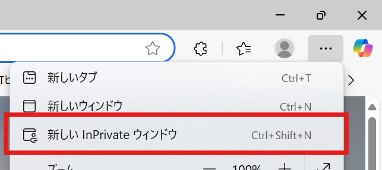
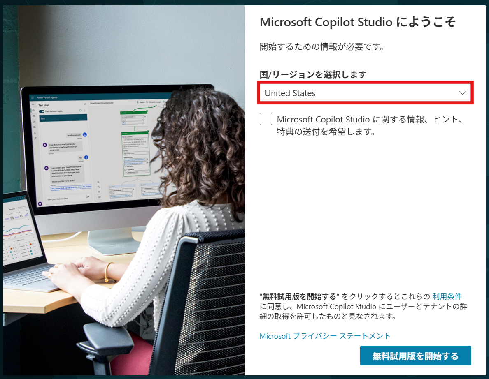

# 事前準備
今回のハンズオンでは、以下の準備を行います。
 

## サインイン
1. 講師から直前にアカウント情報を配布します。 
**【アカウント例】**

| アカウント名 | メールアドレス | パスワード |
|--------------|----------------|------------| 
| user1 | user1@example.com | Password1! |

2. Microsoft EdgeまたはGoogle Chromeを起動します。

3. 画面右上の[・・・] > [新しい InPrivate ウィンドウ]（Edgeの場合）または[新しいシークレット ウィンドウ]（Chromeの場合）をクリックし、プライベートブラウズモードを開きます。 
 
> [!NOTE]
> 今回のハンズオンでは、全てこのプライベートブラウズモードを使用します。 
> プライベートブラウズモードを使用では、キャッシュやCookieの影響を受けずにサインインできます。

4. https://m365.cloud.microsoft/?auth=2 にアクセスし、配布されたアカウント情報でサインインします。
 
 
 

## Microsoft Copilot Studio 試用版へサインアップする
1. https://copilotstudio.microsoft.com に移動します。
2. サインインを求められたら、メール アドレスとパスワードを入力し、サインインします。
3. 国/リージョンを**United States**に選択し、[無料試用版を開始する] を選択します。 
 
> [!IMPORTANT] 
> [演習2 Copilot Studio でエージェントを作成する (生成モード)](2-create-agent-generationmode.md)はプレビュー版の機能を利用するため、United States環境でのみ動作します。 
> 誤って他のリージョンを選択した場合は、講師に連絡してください。 

4. [Copilot Studio へようこそ!] というポップアップで、[スキップ] を選択します。
 
 
 

# 次のステップ
[Copilot Studio でエージェントを作成する](1-create-agent-chat.md)

