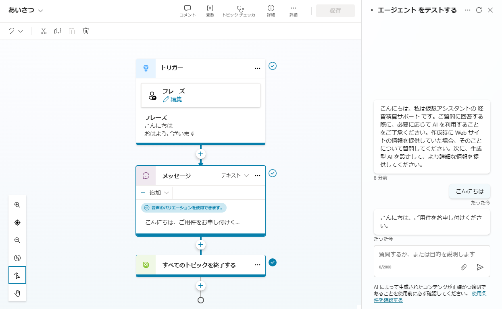
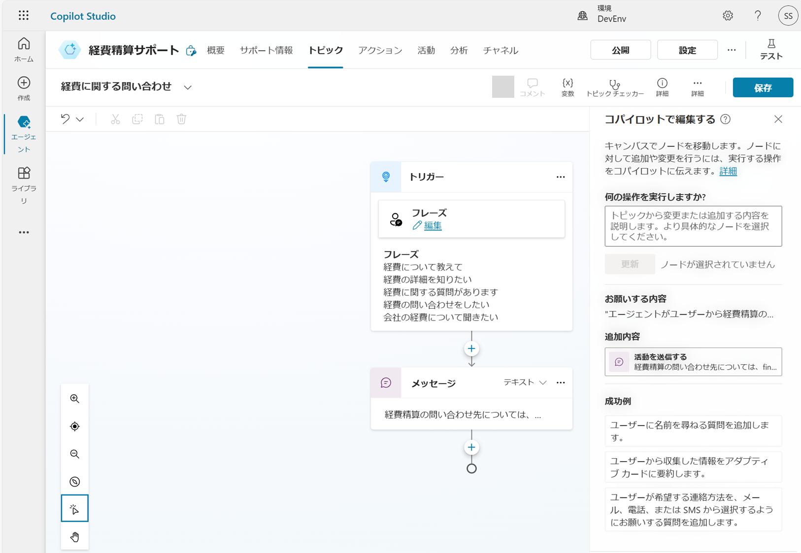
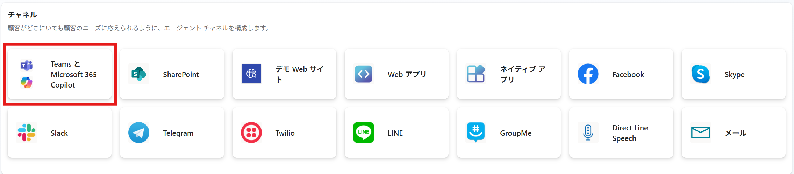
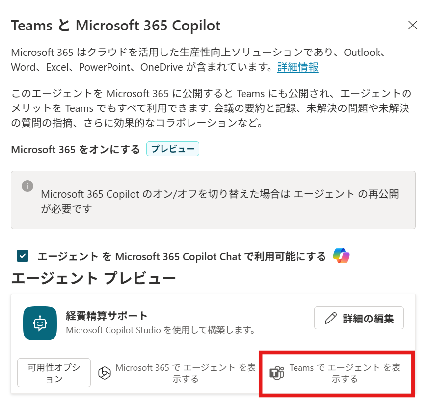

# Copilot Studio でエージェントを作成する
この演習では、Copilot Studio を使用して、架空の企業の経費ポリシーに関する従業員の質問に答えることができる簡単なエージェントを作成します。<br>
<br>

## エージェントを作成する
Copilot Studio を使用して新しいエージェントを作成します。<br>
1. [https://copilotstudio.microsoft.com/](https://copilotstudio.microsoft.com/) に移動します。[Copilot Studio へようこそ!] というポップアップが表示された場合は、スキップします。
2. Copilot Studio のホームページが表示されます。<br>
右上の [環境] で指定の環境[(アカウント名) の環境]が選択されていることを確認します。<br>
<br>

> [!WARNING]<br>
> [ホーム] ページでは、最近作業したエージェントが表示されます。[エージェント] ページでは、既存のすべてのエージェントが表示されます。作成したエージェントに加えて、Copilot Studio を使用して拡張できる Microsoft 365 Copilot (旧称 Copilot for Microsoft 365) が表示される場合があります。<br>

3. 左側のナビゲーション ウィンドウで、[作成] を選択して、次のようなページを表示します。(ここから、新しいエージェントを作成することも、テンプレートから開始することもできます)<br>
<br>

4. [新しいエージェント] を選択します。<br>
5. 会話形式でエージェントを作成します。チャット ウィンドウで次のプロンプトを入力します。<br>
```
従業員の経費精算を支援するエージェントを作成します。
```

> [!WARNING]<br>
> チャット ウィンドウが表示されない場合は、構成画面で以下の内容を入力します。また、言語が [日本語 (ja-JP)] と設定されていることを確認します。その後、[作成] をクリックし、エージェントを作成します。<br>
> **名前:** ```経費精算サポート```<br>
> **説明:** ```従業員の経費精算を支援するエージェントです。経費の提出方法、承認プロセス、払い戻しの手順についてガイドし、よくある質問に答えます。```<br>
> **指示:**
> ```従業員の経費精算を支援する。```<br>
> ```経費の提出方法、承認プロセス、払い戻しの手順についてガイドする。```<br>
> ```経費精算に関するよくある質問に答える。```<br>
> ```経費精算のステータスを確認する。```<br>
> ```経費精算に関するポリシーや規則を提供する。```<br>
> ```親しみやすく、明確で簡潔な言葉で説明する。```<br>
> ```フレンドリーでプロフェッショナルな口調を使用する。```<br>
> ```税金に関するアドバイスを提供しない。```<br>
> <br>
> 完了したら、次の手順3つをスキップし、エージェントのテストに進みます。

6. Copilot Studio からの応答を確認します。チャット ウィンドウは、次のようになります。<br>
<br>
> [!NOTE]<br>
> 右のウィンドウで、エージェントのプライマリ言語が [日本語 (ja-jp)] と設定されていることを確認します。他の言語に設定されている場合は、[言語の編集] をクリックして、日本語に変更します。<br>
たとえば、「エージェントの基本的な設定が完了しました。次に、このエージェントの名前を決めましょう。例えば、「経費精算サポート」という名前はいかがでしょうか？この名前でよろしいですか？」といった内容の応答が返るので、問題ない場合は「はい」など同意する旨を入力します。<br>
7.	会話を続行して、Copilot Studio からの質問に応じて、次のような内容をひとつずつ入力していき、エージェントを定義します。<br>
- ```フレンドリーでプロフェッショナルな口調を使用してください。```
- ```一般公開されている Web サイトを使用して情報を入手しないでください。後でナレッジソースを追加します。```
- ```税金に関するアドバイスを提供することは避けてください。```
> [!NOTE]<br>
> 質問の内容や順番は固定ではなく、変わる可能性があります。Copilot Studio からの質問に応じて回答してください。<br>
完了すると、エージェントのチャットインターフェイスのプレビューが会話の横に表示されます。<br>
<br>
8. 準備ができたら、右上の [作成] をクリックしてエージェントを作成します。しばらくすると、次のように表示されます。<br>
<br>
9. エージェントをテストします。[エージェントをテストする] ペインで次のプロンプトを入力し、応答を確認します。<br>
```
こんにちは
```
10. 次に、次のプロンプトを試してください。
```
経費精算の提出については、どこに問い合わせればよいですか?
```
応答は適切かもしれませんが、かなり一般的なものになる可能性があります。実際の組織では、エージェントにはユーザーが連絡するメールアドレスや電話番号を提供してもらいたいでしょう。<br>
<br>
11.	別のプロンプトを試してみましょう。
```
ホテル滞在の費用制限はいくらですか?
```
繰り返しになりますが、応答は適切ですが、一般的である可能性があります。実際の組織では、エージェントに自社の経費ポリシーに基づいてより具体的な回答を提供してもらいたいでしょう。
> [!NOTE]<br>
> [トピック間の追跡]を有効にすると、トピックからトピックに移動する会話を自動的に追跡します。<br>
> <br>
> <br>
12.	[エージェントをテストする] ペインを閉じます。<br>
<br>
<br>
<br>

## エージェントのトピックを管理する

トピックを使用して、トリガーに対して明示的な応答 (一般的な質問やユーザーに入力を期待するリクエストなど) を提供できます。
1. エージェントのページで、[トピック] タブを選択して、そのトピックを表示します。<br>
<br>
エージェントには、ユーザーからの入力によってトリガーされるいくつかのカスタムトピックと、エラーや予期しない入力などの特定のイベントによってトリガーされる追加のシステム トピックがあります。トピックをカテゴリ別にフィルタリングするか、[すべて] フィルターを使用してすべてを表示することができます。<br>
<br>
2. あいさつトピックを選択して、トピックを作成および編集するためのビジュアル デザイナーであるオーサリング キャンバスに表示します。これは、次のように表示されます。<br>

<br>
あいさつトピックは、次のいずれかの語句が存在する入力によってトリガーされます。
- こんにちは
- おはようございます

このトリガーにより、ユーザーに “こんにちは、ご用件をお申し付けください。” というメッセージが返されます。このトピックをエージェントに含めると、前の手順であいさつのテストをしたときのような応答が行われます。<br>

3. トピックの一覧に戻り、システム トピックを表示します。これらには、会話の一般的なイベントのトピックが含まれていることに注意してください。特に、次のシステム トピックに注意してください。
- 会話の強化: このトピックは、エージェントが対応するトピックを特定できない (ユーザーの意図が不明な) メッセージをユーザーが送信したときにトリガーされます。その後、トピックは生成 AI を使用してユーザーのメッセージに応答しようとします。
- フォールバック: このトピックは、意図が不明で、適切な会話型 AI 応答を生成できない場合に応答する "フェールセーフ" トピックです。フォールバック トピックには、ユーザーが会話を正常に終了する前に最大 3 回再試行できるようにするロジックが含まれています。(多くの場合、人間のオペレーターにエスカレーションします)
4. トピックの一覧に戻り、[+ トピックの追加] > [Copilot で説明をもとに作成する] をクリックします。<br>
<br>
5. [Copilot で説明をもとに作成する] ダイアログ ボックスで、新しいトピックに名前を付け、トピックが何をすべきかを Copilot に伝えるテキストを入力します。<br>

**トピック名を指定する:** ```経費に関する問い合わせ```<br>
**トピックを作成する...:** ```エージェントがユーザーから経費精算の問い合わせ先を聞かれたら、finance@contoso.com にメールを送信するように回答します。```<br>

6.	[作成] をクリックします。
7.	少し待つと、”経費に関する問い合わせ” という名前の新しいトピックが作成され、オーサリング キャンバスで開きます。次のようになります。<br>
<br>
新しいトピックは、経費の連絡先について尋ねるフレーズによってトリガーされ、適切なアドレスに電子メールを送信するようにユーザーに指示するメッセージで応答します。<br>
>[!NOTE]<br>
> 意図しないノードが追加されている場合は、手動で削除、編集します。
8.	[保存] ボタンをクリックして、新しいトピックをエージェントに保存します。
9.	[テスト] ウィンドウを開き、次のプロンプトを入力します。<br>
```
経費精算の提出について、どこに問い合わせればよいですか?
```
追加したトピックに基づいて応答が行われます。(入力したテキストがトリガー内のどのフレーズとも完全に一致していなくても、トピックをトリガーするのに十分に意味的に近い必要があります)<br>

10.	[エージェントをテストする] ペインを閉じます。
<br>
<br>
<br>

## エージェントにナレッジソースを追加する
ユーザーが入力すると予想されるすべての入力に対してトピックを追加できますが、すべての質問を想定することは現実的ではありません。現在、エージェントは 会話の強化 トピックを使用して言語モデルから AI 応答を生成しますが、これにより一般的な回答が得られます。生成 AI 応答をより関連性の高い自社の情報に基づいたものにするためのナレッジソースを提供する必要があります。<br>
1. [経費ポリシードキュメント](CopilotHandsonDocs/Expenses_Policy.docx) ファイルをダウンロードします。ファイルをローカルに保存します。このドキュメントには、架空の Contoso 社の経費ポリシーの詳細が含まれています。<br>
> [!NOTE]<br>
> ドキュメントダウンロードするには、[リンク](CopilotHandsonDocs/Expenses_Policy.docx)をクリックして該当のページに移動し、ダウンロードアイコンをクリックします。
> <br>
2. [サポート情報] タブをクリックして、エージェントで定義されているナレッジソースを表示します。(今は存在しないはずです)<br>
<br>
3. [+ ナレッジの追加] をクリックします。エージェントに追加できるナレッジ ソースの種類が複数あることが分かります。<br>
<br>
4. [ファイルのアップロード] セクションで、以前にダウンロードした経費ポリシードキュメントをアップロードし、エージェントのナレッジに追加します。<br>
> [!NOTE]<br>
> ファイルをアップロードした後、インデックスが作成されるまで待つ必要があります。これには 10 分 (またはそれ以上) かかる場合があります。準備が完了すると、次のようになります。
> <br>
5. ファイルの準備ができたら、[トピック] ページを表示し、会話の強化 システム トピックを開きます。このトピックは意図が不明な場合にトリガーされ、アップロードしたファイルなどのナレッジを含むデータソースに基づいて生成AI応答を作成しようとすることを思い出してください。<br>
> [!NOTE]<br>
> 追加したカスタムナレッジソースに関連する回答が見つからない場合、トピックでは言語モデルが保持しているナレッジを使用して、より一般的な回答を提供する場合があります。トピックが返す生成 AI 応答のハルシネーションをより少なくする為に、検索を特定のナレッジに制限するように構成できます。
6. [テスト] ペインを開き、会話を再開します。次に、次のプロンプトを入力します。
```
ホテル滞在の費用制限はいくらですか?
```
回答は、アップロードしたナレッジソースの情報に基づいており、引用文献を含みます。
<br>
7. 次のようなフォローアップの質問をしてみてください。
```
航空券の費用はどうですか?
交際費のガイドラインにはどのようなものがありますか?
```
8. [エージェントをテストする] ペインを閉じます。
<br>
<br>
<br>

## エージェントを公開する
> [!WARNING]<br>
> この手順ではチャネルとして Microsoft Teams を使用します。Microsoft Teams でのエージェントの使用を試さない場合は、このセクションをスキップします。<br>

エージェントが作成できたので、他のユーザーが使用できるように公開できます。ここでは、エージェントを公開し、Microsoft Teams で使用するための設定を行います。

1. ページの上部にある [チャネル] タブを選択し、エージェントをデプロイできるチャネルを確認します。使用可能なチャネルは、エージェントの認証設定によって異なります。
2. ページの上部にある [設定] を選択します。
3. [設定] ウィンドウの [セキュリティ] タブで [認証] を選択します。[Microsoft で認証する] が選択されていることを確認します。
4. [設定] ウィンドウを閉じます。
5. ページの上部にある [公開] をクリックします。<br>
<br>
6. [このエージェントを公開する] ウィンドウで [公開する] をクリックし、エージェントを公開します。<br>
<br>
7. エージェントが公開されたら、[チャネル] ページで状態を確認します。<br>
<br>
8. [チャネル] で [TeamsとMicrosoft 365 Copilot] を選択します。<br>
<br>
9. [チャネルを追加する]をクリックします。<br>
<br>
10. [詳細の編集] をクリックします。
<br>
11. エージェントのアイコン、色、説明などを必要に応じて変更し、[保存] をクリックします。
<br>
> [!NOTE]<br>
> 他のユーザーがエージェントを使用できるようにするためには、さらに追加の設定が必要です。
12. [エージェントを開く] をクリックし、Teams を起動します。<br>
<br>
> [!NOTE]<br>
> 今回の演習では、Web ブラウザーで Teams を使用します。[このサイトは、Microsoft Teams を開こうとしています。] というメッセージが表示された場合、[キャンセル] をクリックし、[代わりに Web アプリを使用] をクリックして Teams を開きます。

> [!NOTE]<br>
> [このアプリが見つかりません。] というメッセージが表示された場合は、少し時間をおいてからお試しください。

12. [追加] をクリックし、エージェントを追加します。<br>
<br>
13.	追加されたことを確認し、[開く] をクリックします。<br>
<br>
14. 次の質問を入力し、応答を確認します。<br>
```
経費精算の提出について、どこに問い合わせればよいですか?
```
<br>
<br>
<br>
<br>

# 次のステップ
[Copilot Studio でエージェントを作成する (生成モード)](2-create-agent-generationmode.md)
