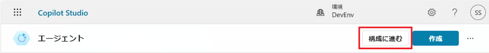

# Copilot Studio でエージェントを作成する (生成モード)
この演習では、Copilot Studio を使用して、生成モードを使用するエージェントを作成します。
<br>

## エージェントを作成する

1. [https://copilotstudio.microsoft.com/](https://copilotstudio.microsoft.com/) に移動します。
2. 左側のナビゲーション ウィンドウで、[作成] をクリックします。
3. [新しいエージェント] をクリックします。
4. [構成に進む] をクリックします。<br>
<br>
> [!NOTE]<br>
> [構成に進む] ボタンが表示されない場合は、この手順は無視してください。
5. [言語の編集] をクリックします。<br>
<br> 
6. エージェント のプライマリ言語で [英語 (en-US)] を選択し、[保存] をクリックします。<br>
<br>
7. 名前、説明、指示をそれぞれ入力します。<br>
**名前:** ```Weather Agent```<br>
**説明:** ```An assistant for getting weather forecasts.```<br>
**指示:** ```Always be friendly and polite. Only answer questions related to the weather.```<br>
8. [作成] をクリックします。<br>
<br>
<br>
<br>

## エージェントの生成オーケストレーションをオンにする

1. エージェントのページの右上の [設定] をクリックし、エージェントの設定を開きます。
2. [生成 AI] タブをクリックします。
3. [生成 (プレビュー)] を選択し、[保存] をクリックします。<br>
<br>
4. 右上の [×] をクリックして、設定を閉じます。<br>
<br>
<br>
<br>

## エージェントにアクションを追加する
1. エージェントのページで、[アクション] タブをクリックします。
2. [+ アクションを追加する] をクリックします。
3. 右上の検索ボックスに “MSN 天気” と入力して検索します。
4. [今日の予報を取得する] を選択します。<br>
<br> 
5. [MSN 天気] の横に、緑のチェックマークがついていることを確認して、[次へ] をクリックします。<br>
<br> 
6. [エンド ユーザー認証] で、[コパイロット作成者の認証] を選択します。<br>
<br>
> [!NOTE]<br>
> 一部のアクションは、正しく動作させるのに認証が必要です。アクションは [ユーザー認証] と [コパイロット作成者の認証] の 2 種類の認証方法がサポートされます。
7. [入力と出力] を展開し、Units で [編集] をクリックします。<br>
<br> 
8. [エージェント はこの入力にどのような情報を入力しますか?]　で [値として設定する] を選択します。[入力の設定を変更する] ウィンドウが表示されたら、[確定] をクリックします。
9. [値] で [C] を選択し、[完了] をクリックします。<br>
<br> 
10. [アクションの追加] をクリックします。<br>
<br>
11. アクションが追加されたことを確認します。<br>
<br>
<br>
<br>
<br>

## エージェントをテストする

1.	エージェントのページの右上の [テスト] をクリックし、[エージェントをテストする] ペインを表示します。
2.	次のプロンプトを入力します。
```
today's forecast
```
3.	エージェントからの質問に応じて、都市の情報を入力します。
4.	エージェントから天気の情報が返されることを確認します。<br>
<br>
<br>
<br>
<br>

# 以上でハンズオンは終了です
お疲れさまでした！<br>
次のステップでは、デモ環境の削除方法を説明します。<br>
[環境をクリーンアップする](3-cleanup.md) 
