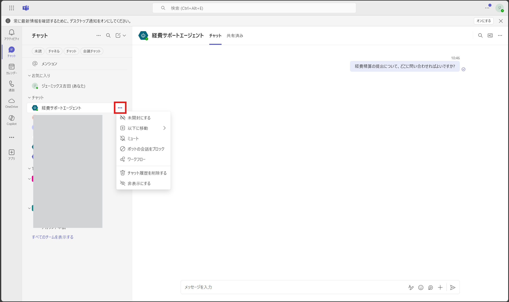
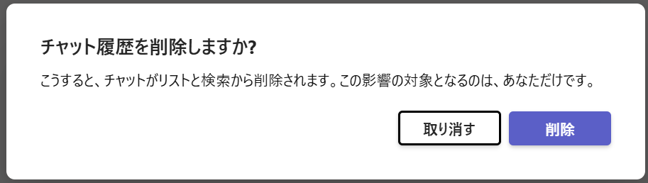
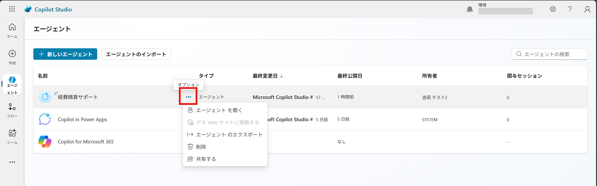
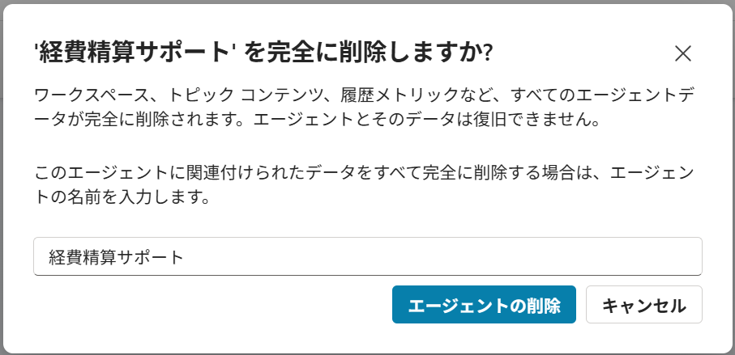

# 環境をクリーンアップする
ハンズオン終了後は、環境のクリーンアップをお願いいたします。

## Teams チャットから削除する
1. [https://teams.microsoft.com/](https://teams.microsoft.com/) に移動します。
2. 左側のナビゲーション ウィンドウで、[チャット] をクリックします。
3. 削除するエージェントのチャットのオプションをクリックします。 
 
4. [チャット履歴を削除する] をクリックします。
5. [削除] をクリックします。 
 
 
 
 

## Copilot Studioから削除する
1. [https://copilotstudio.microsoft.com/](https://copilotstudio.microsoft.com/) に移動します。
2. 左側のナビゲーション ウィンドウで、[エージェント] をクリックします。
3. 削除するエージェントのオプションを選択します。 
 
4. [削除] をクリックします。
5. エージェントの名前を入力し、[削除] をクリックします。 
 
7. エージェントが削除されたことを確認します。

